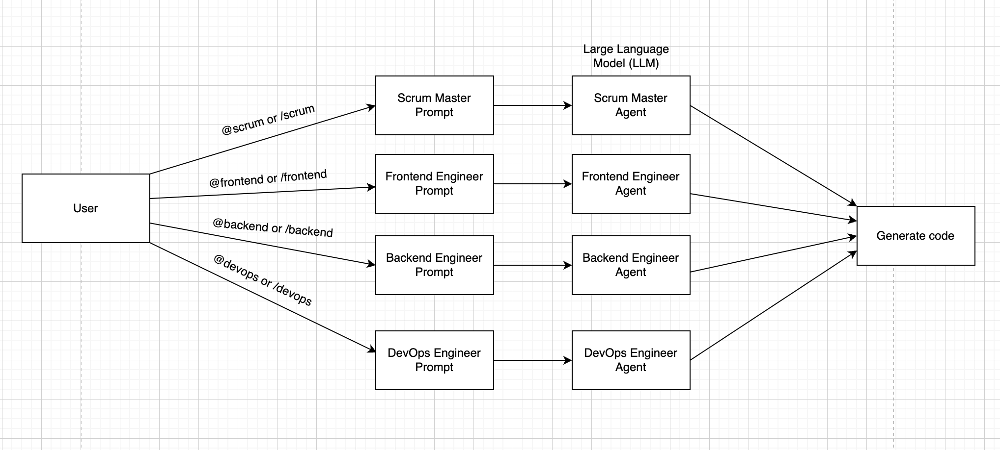

<h4 align="center">
    <br> 
</h4>

<h4 align="center">
    Multiagent Discord Bot
    <!-- <div align="center">
    <br>
        <a href=".">
            
        </a>
    </div> -->
</h4>

<p align="center">
    <a href="#description">Description</a> •
    <a href="#project-structure">Structure</a> •
    <a href="#how-does-it-work">How does it work</a> •
    <a href="#license">License</a> •
    <a href="#setup"> Setup</a>
</p>

### Description

This project is a multi-agent discord bot that simulates a software development team. The bot has four agents: frontend, backend, devops, and scrum master. Each agent has its own set of instructions and can communicate with other agents to complete tasks. Throughout this project, users can interact with the bot to assign tasks to agents, check the status of tasks, and view the instructions for each agent with faster software development.

### Project structure

```txt
├── agents/
│   ├── __init__.py        # Initialize agents module
│   ├── frontend_agent.py  # Frontend agent logic
│   ├── backend_agent.py   # Backend agent logic
│   ├── devops_agent.py    # DevOps agent logic
│   ├── scrum_master_agent.py # Scrum master logic
│
├── instructions/
│   ├── frontend.txt
│   ├── backend.txt
│   ├── devops.txt
│   ├── scrum-master.txt
│
├── app/
│   ├── __init__.py        # Initialize Flask app
│   ├── routes.py          # Flask routes for inter-agent communication
│
├── bot/
│   ├── __init__.py        # Initialize Discord bot
│   ├── commands.py        # Define Discord bot commands
│
├── tests/
│   ├── test_agents.py     # Unit tests for agent logic
│   ├── test_integration.py # Integration tests
│
├── requirements.txt       # Python dependencies
├── serverless.yml         # Serverless framework config (for AWS Lambda)
├── .env                   # Environment variables (e.g., Discord token) [change .env.example to .env]
├── main.py                # Entry point for running locally
├── README.md              # Project documentation
├── requirements.txt       # Python dependencies
├── .gitignore             # Files to ignore in git
└── LICENSE                # Project license
```

### How does it work?

<h4 align="center">
    <br> 
</h4>

[need to work on more]

prototype

AI Routing

### License

This project is under MIT Licnese. You are welcome to contribute to this project.

### Setup

This project requires virtual environment to manage dependencies.
This project has built with Python 3.11.

#### How to create virtual environment

```bash
# create virtual environment
python3 -m venv venv

# activate virtual environment
source venv/bin/activate

# fish shell
. venv/bin/activate.fish
```

#### How to install all dependencies

```bash
pip install -r requirements.txt
```
